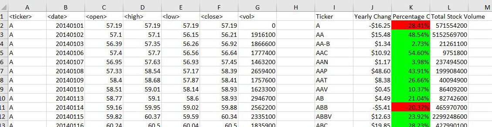
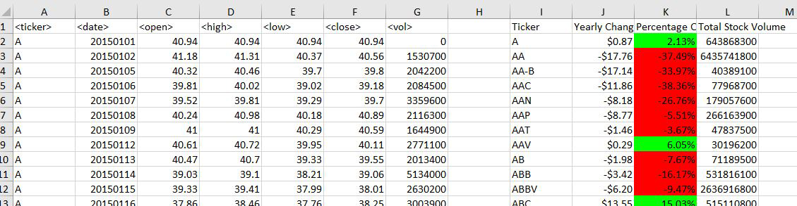
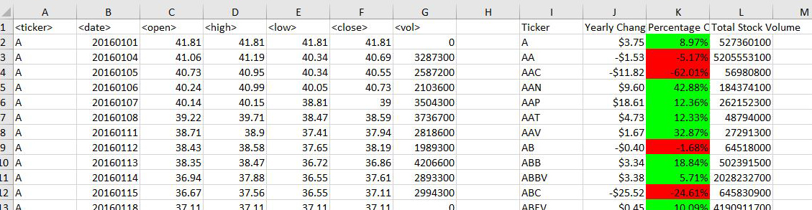

# VBA: Stock Market Analysis

Analyze stock market data for the years 2014, 2015, and 2016 using VBA scripting in Excel.  Script loops through all the stocks for one year and outputs the following information:

        * The ticker symbol.
        * Yearly change from opening price at the beginning of a given year to the closing price at the end of that year.
        * The percent change from opening price at the beginning of a given year to the closing price at the end of that year.
        * The total stock volume of the stock.

Conditional formatting highlights the positive change in green and negative change in red.  Scripts are in the 'SH_VBAofWallStreet' files; both are identical except for format.  Larger screenshots are in the local '2014', '2015', and '2016' JPG files.

